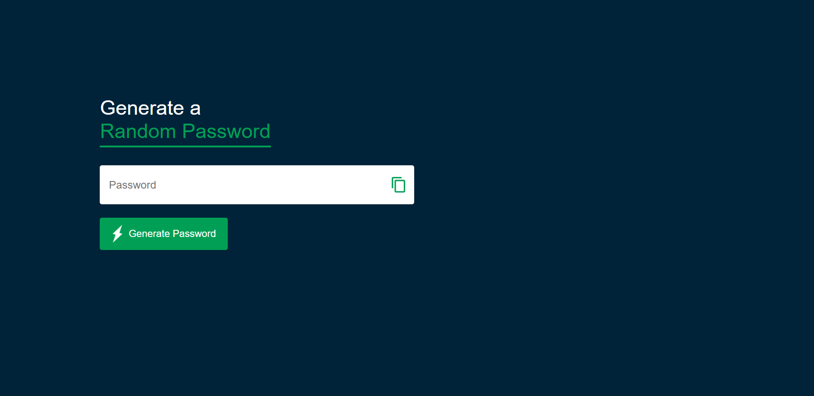

# 🔐 Random Password Generator

A sleek, responsive **Random Password Generator** built using **HTML**, **CSS**, and **JavaScript**. This tool helps users create secure, random passwords with customizable options. Perfect for anyone who wants to improve their online security.

---

## 🌟 Features

- ✅ **Customizable Password Length**
- 🔠 **Choose Characters**: Uppercase, lowercase, numbers, and special symbols
- 📋 **Copy to Clipboard**: One-click copy functionality
- 💻 **Responsive Design**: Works across all device sizes
- ⚡ **Instant Generation**: Get a secure password in milliseconds

---

## 📸 Demo

  
> *(Include your screenshot in the project folder as `screenshot.png`)*

Live Demo: [Click here to try it out](https://randompasswordgeneratorbyashik.netlify.app/)  
> *(Replace `#` with your live URL if hosted, e.g., GitHub Pages, Vercel, Netlify, etc.)*

---

## 🛠️ Technologies Used

- **HTML** – Markup structure
- **CSS** – Stylish and responsive UI
- **JavaScript** – Logic for generating and copying passwords

---

## 🚀 How to Use

1. Clone the repository:
   ```bash
   git clone https://github.com/ashikur221/Random-Password-Generator.git
